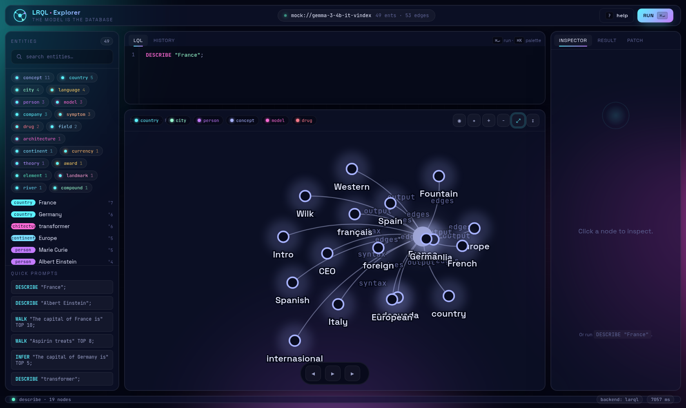
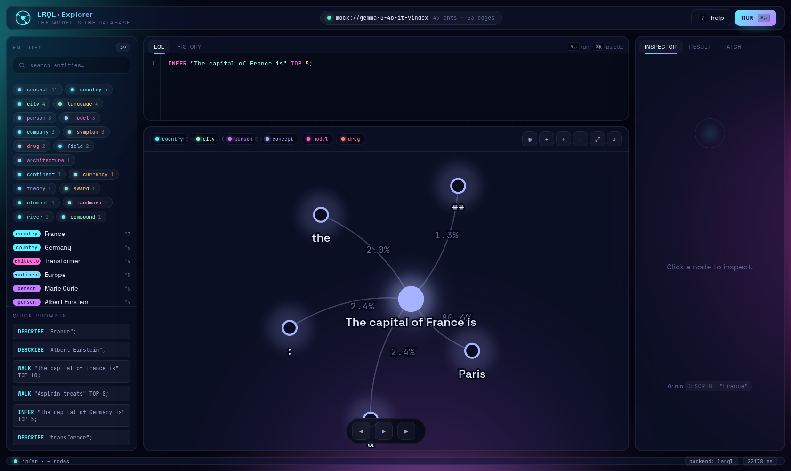
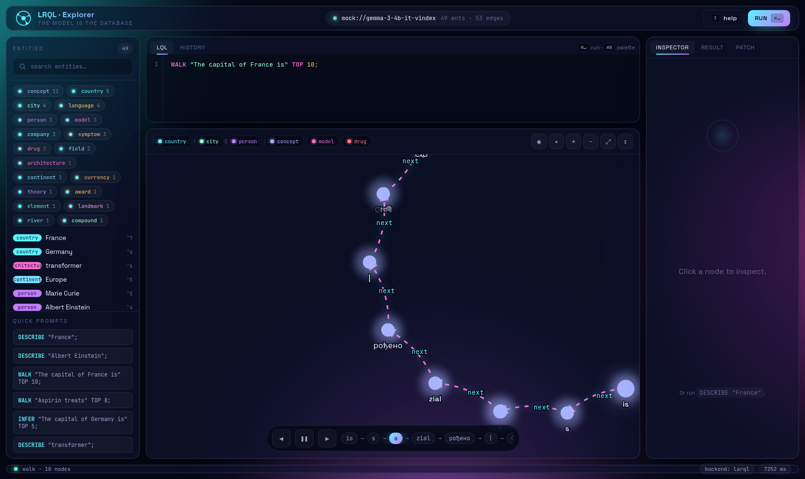
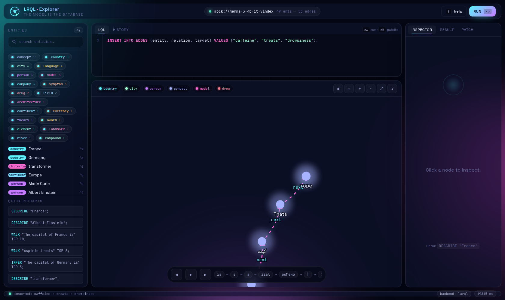
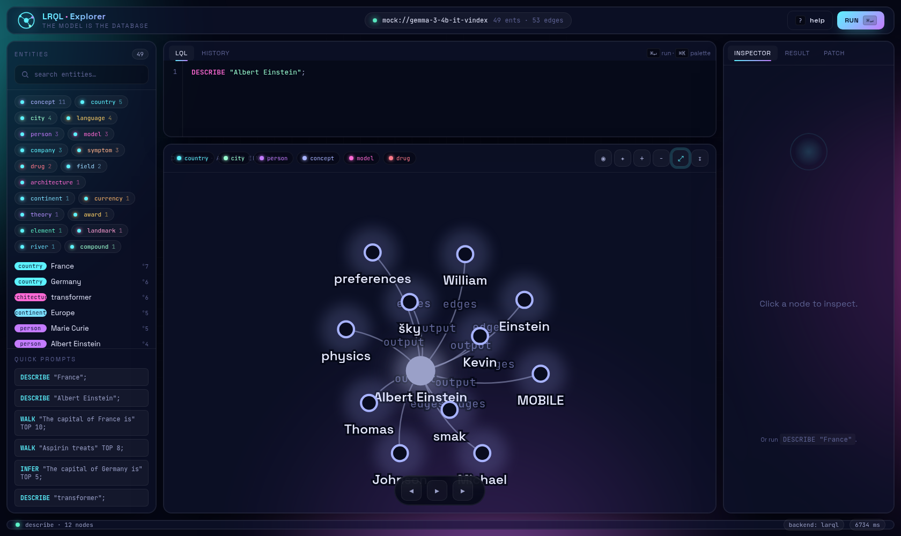

# lrql-knowledge

A futuristic, neo4j-browser-style **knowledge graph explorer** for [LARQL](https://github.com/chrishayuk/larql) — Chris Hayuk's project that treats neural-network weights as a queryable database (the model *is* the database).

This explorer lets you browse the relations encoded inside a vindex with a polished web UI. It speaks **LQL** (`USE` / `DESCRIBE` / `WALK` / `INFER` / `INSERT INTO EDGES`) and visualises results as an interactive force-directed graph.




## Screenshots

### LARQL backend

The same flows against `gemma3-4b-it.vindex` via the real `larql` Rust binary. Edges are parsed live from the model's weight-derived knowledge — no preloaded graph file.

| | |
|---|---|
| `DESCRIBE "France"` — 18 edges parsed across Syntax / Edges / Output | **`INFER "The capital of France is"` → Paris (80.64%)** |
|  |  |
| `WALK "The capital of France is" TOP 10` — per-layer trail | `INSERT INTO EDGES (caffeine, treats, drowsiness)` — installed at L26 |
|  |  |
| `DESCRIBE "Albert Einstein"` cluster | |
|  | |

## Highlights

- **D3 force-directed graph** with neon node halos, gradient trail edges for `WALK`, animated dash-flow, hover tooltips, drag-to-pin, pan/zoom, fit-to-view, SVG export.
- **LQL editor** with live syntax highlighting (keywords, strings, numbers, comments), `⌘↵` to run, history tab, autocompleting suggestion chips.
- **Entity browser** with kind filters, instant search (`/` to focus), and an inspector that lists outgoing/incoming edges with weights.
- **WALK player** — play / step / scrub through a token trail through the graph; the active node and edge are spotlighted while the rest dims.
- **Patch panel** to fire `INSERT INTO EDGES` statements without writing LQL.
- **Real backend or mock**: if the `larql` Rust binary is on `PATH` and `LARQL_VINDEX` points to a vindex, queries are forwarded; otherwise a built-in mock vindex (geography, science, transformer models, medicine) keeps everything explorable.

## Running

### Mock mode (zero dependencies beyond `uv`)

```bash
./run.sh
# open http://127.0.0.1:8000
```

### Real LARQL backend

```bash
# Build the Rust CLI per the LARQL README
cargo build --release
larql pull hf://chrishayuk/gemma-3-4b-it-vindex

# Then point this explorer at it
LARQL_BIN="$(which larql)" \
LARQL_VINDEX=./gemma-3-4b-it-vindex \
./run.sh
```

The backend wrapper (`backend/lrql_client.py`) forwards every statement through
`larql lql` (the universal LQL entry point) with a `USE` preamble each call,
then parses the text output:

| LQL                                          | CLI invocation                                                            |
| -------------------------------------------- | ------------------------------------------------------------------------- |
| `DESCRIBE "France"`                          | `larql lql 'USE "<vindex>"; DESCRIBE "France";'`                          |
| `WALK "The capital of France is" TOP 10`     | `larql lql 'USE "<vindex>"; WALK "..." TOP 10;'`                          |
| `INFER "The capital of France is" TOP 3`     | `larql lql 'USE "<vindex>"; INFER "..." TOP 3;'`                          |
| `INSERT INTO EDGES (...) VALUES (...)`       | `larql lql 'USE "<vindex>"; INSERT INTO EDGES ... VALUES (...);'`          |

The wrapper handles both the inference-capable INFER format
(`1. Paris (97.91%)`) and the per-layer feature dump that browse-only vindexes
fall back to.

## Try these

```sql
DESCRIBE "France";
WALK "The capital of France is" TOP 10;
INFER "The capital of Germany is" TOP 5;
DESCRIBE "Albert Einstein";
INSERT INTO EDGES (entity, relation, target) VALUES ("aspirin", "treats", "headache");
```

## Layout

```
backend/
  server.py        FastAPI app + static frontend mount
  lrql_client.py   LQL parser + larql CLI wrapper (mock fallback)
  mock_vindex.py   Sample knowledge graph for offline use
frontend/
  index.html       App shell
  css/             Theme + components + graph styling
  js/
    main.js        Wires everything together
    graph.js       D3 force graph (selection, walk highlight, export)
    editor.js      Contenteditable LQL editor with live highlighting
    lql.js         LQL tokenizer / highlighter
    api.js         Backend client
    store.js       Tiny pub/sub store
```

## Keyboard

| Key      | Action                |
| -------- | --------------------- |
| `⌘↵` / `Ctrl↵` | run query        |
| `/`      | focus entity search   |
| `Esc`    | close help            |

## Roadmap (next iterations)

- Path comparison view for two competing `WALK` traces
- Heatmap mode coloring nodes by edge weight density
- Diff viewer for `BEGIN PATCH` / `SAVE PATCH`
- Server-sent events for streaming `WALK` traversal in real time
- Snapshot export with notes (PNG + JSON)
